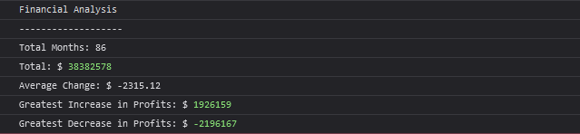

# Console-Finances

Bootcamp Week 4 Challenge: Create code for analyzing the financial records of a company
## Description 

    1. Create a new GitHub repo called Console-Finances. Then, clone it to your computer.

    2. Copy the starter files into your local git repository.

You have been given a dataset composed of arrays with two fields: Date and Profit/Losses.

Your task is to write JavaScript code that analyzes the records to calculate each of the following:

    * The total number of months included in the dataset.

    * The net total amount of Profit/Losses over the entire period.

    * The average of the changes in Profit/Losses over the entire period.

        ** You will need to track what the total change in profits 
           is from month to month and then find the average.

        ** (Total/Number of months)

    * The greatest increase in profits (date and amount) over the entire period.

    * The greatest decrease in losses (date and amount) over the entire period.

## Screenshot

## Sources
https://www.javascripttutorial.net/javascript-array/

https://developer.mozilla.org/en-US/docs/Web/JavaScript/Reference/Statements/for

https://www.javascripttutorial.net/javascript-for-loop/

https://www.javascripttutorial.net/javascript-if-else-if/

